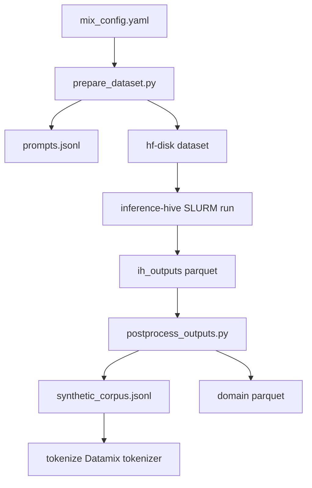

# Datamix 1B synthetic data pipeline (inference-hive)

Generate **~1B tokens** of synthetic pretraining data aligned with the Datamix mixture, using **inference-hive** for cluster-scale generation. Prompt design and QC borrow ideas from **synthgen** (domain axes, leakage filters, resume-friendly JSONL), but this pipeline uses a **single-pass** generation model suited to billion-token scale.

## Target mixture

Mirrors Datamix pretraining sources and weights:

| Domain | Fraction | Style inspiration | Default avg tokens/doc |
|--------|----------|-------------------|------------------------|
| English | 72% | Nemotron-CC high/medium-high actual | 900 |
| Code | 7.2% | StarCoder | 700 |
| Math | 10.4% | FineMath 4+ | 600 |
| Multilingual | 10.4% | HPLT 2.0 (36 langs) | 800 |

Tokenizer for counting/export: **Datamix 9B** (`openeurollm/datamix-9b-80-20`, Gemma-3 family, 262k vocab).

**Generator model:** same Datamix checkpoint — not a separate Gemma base model.

**Max sequence length:** 2048 tokens total (`~512` meta-prompt + `1536` completion) — matches Datamix `max_position_embeddings`.

At default settings this plans **~1.27M prompts** and **~1.0B estimated completion tokens**.

## Architecture



**vs synthgen:** synthgen uses two LLM calls per example (meta-prompt → user prompt → response) with a single-machine async client. This pipeline sends one meta-prompt per row and treats the **assistant completion as the training document**, which halves generation cost and fits inference-hive's sharded SLURM model.

## Quick start

```bash
cd inference-hive/examples/datamix_1b_synthetic
export DATAMIX_SYNTH_ROOT=$PWD

# 1. Review token budget
./run_pipeline.sh plan

# 2. Build prompts + inference-hive dataset
./run_pipeline.sh prepare

# 3. Edit SLURM settings (model path is pre-set to local Datamix 9B)
$EDITOR config_datamix_1b.yaml   # partition, account

# 4. Validate, create run, submit (start small)
./run_pipeline.sh validate
./run_pipeline.sh create-run
./run_pipeline.sh submit 2        # 2 shards first; then scale up

# 5. Monitor
./run_pipeline.sh status

# 6. After completion
./run_pipeline.sh postprocess
./run_pipeline.sh tokenize          # Gemma-3 token counts
```

## Files

| File | Purpose |
|------|---------|
| `mix_config.yaml` | Token budget, domain fractions, languages |
| `config_datamix_1b.yaml` | inference-hive SLURM + vLLM config |
| `prepare_dataset.py` | Build prompts and hf-disk dataset |
| `postprocess_outputs.py` | Join outputs, QC, export corpus |
| `datamix_synth/prompts.py` | Domain meta-prompt templates |
| `datamix_synth/budget.py` | Prompt-count planner |
| `run_pipeline.sh` | Step orchestration |

## Prompt design (synthgen-inspired)

Each row samples axes within its domain:

- **English:** subtopic (science, history, how-to, …) × writing style × length bucket
- **Code:** task type × programming language × filename hint
- **Math:** problem type × grade difficulty; enforces `Problem:` / `Solution:` format
- **Multilingual:** language × genre × length; native-script HPLT-style prose

Rows are stored as OpenAI chat conversations with a single user message (meta-prompt). inference-hive writes the model response to parquet.

## Post-processing QC

Inspired by synthgen `filter` / `verify`:

- Reject empty or very short completions
- Reject common assistant leakage phrases
- Reject markdown-fenced code (code domain)
- Reject math without `Problem:`/`Solution:` structure
- Export `corpus/synthetic_corpus.jsonl` with `{id, text, domain, lang}`
- Per-domain parquet under `corpus/domain=<name>/data.parquet`

## Scaling guidance

| Parameter | Starting value | Notes |
|-----------|----------------|-------|
| `num_inference_servers` | 8 | Increase until queue saturated |
| `max_connections` | 64 | Lower for large models |
| `max_tokens` | 3584 | Fits in 4096 context with meta-prompt headroom |
| Submit limit | 2 | Validate logs before full submit |

Expected throughput depends on model size and GPU type. Use `status.py --detailed` for tokens/sec per shard.

## Adjusting the mix

Edit `mix_config.yaml`:

```yaml
english_fraction: 0.72
code_fraction: 0.072
math_fraction: 0.104
multilingual_fraction: 0.104
total_tokens: 1_000_000_000
```

Re-run `./run_pipeline.sh plan` to see updated prompt counts before `prepare`.

## Output format for training

`synthetic_corpus.jsonl` rows:

```json
{"id": "english-0000001", "text": "...", "domain": "english", "lang": "en", "completion_tokens": 842}
```

Feed into your existing LitGPT tokenization pipeline (`bos=False, eos=True`), or use `postprocess_outputs.py --tokenize` for token-count verification with the Datamix tokenizer.

## Top-up run (~300M tokens)

After the main 1B run postprocess (~784M tokens kept), generate an extra **300M completion-token** batch on **16 GPUs** without overwriting the main `ih_outputs/`:

```bash
# SLURM chain (login node)
sbatch slurm/01_prepare_topup.sbatch
sbatch slurm/02_validate_create_run_topup.sbatch
./submit_inference_topup.sh
# after all shards finish:
sbatch slurm/04_postprocess_topup.sbatch   # postprocess + merge + tokenize merged
```

Or locally:

```bash
./run_pipeline_topup.sh plan
./run_pipeline_topup.sh prepare
./run_pipeline_topup.sh validate && ./run_pipeline_topup.sh create-run
./run_pipeline_topup.sh submit
./run_pipeline_topup.sh postprocess
./run_pipeline_topup.sh merge
./run_pipeline_topup.sh tokenize-merged
```

Top-up prompts use `seed: 99` and `id_prefix: topup-` (`mix_config_topup.yaml`) so IDs do not collide with the main run. Merged training corpus: `corpus/synthetic_corpus_merged.jsonl`.

## Pilot run (recommended)

Before the full 1B run, add a pilot block to `mix_config.yaml`:

```yaml
total_tokens: 10_000_000   # 10M tokens
```

Then `prepare` → `submit 1` → `postprocess` → inspect `corpus/synthetic_corpus.jsonl` quality before restoring `total_tokens: 1_000_000_000`.
